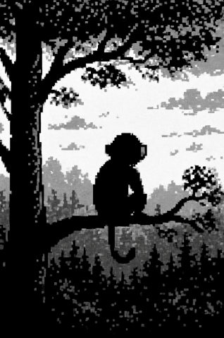
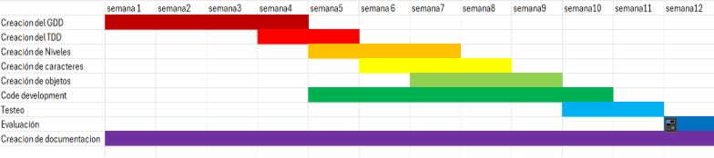
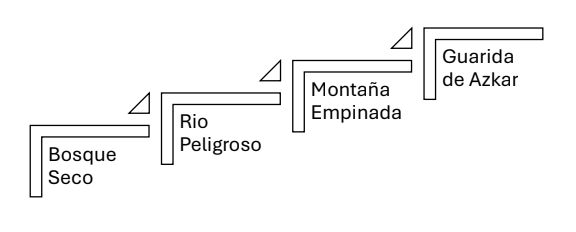
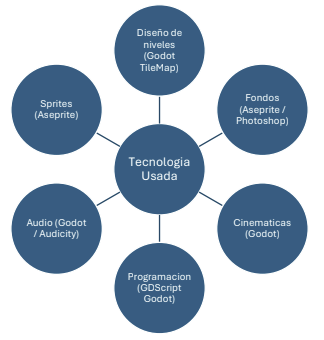
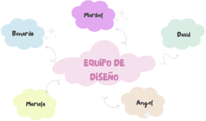
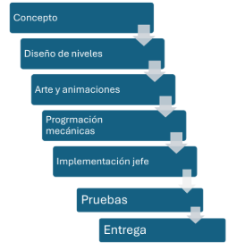

LA AVENTURA DE MIKLO

TDD

Diseñado por Maribel Torres, Mariela Torres, Bernardo García, David Sosa, Angel Acosta
# **Sección 1 - Lista de características obtenidas del GDD**
## **Género:** Plataforma 2D clásico con desplazamiento lateral.

## **Plataformas objetivo:** Escritorio (PC y laptop).

## **Público objetivo y preferencias:** 18–34 años (estudiantes/trabajadores), de nivel
socioeconómico medio. Valoran la jugabilidad clara, poner a prueba sus habilidades,

personalización y buena historia.
##
## **Historia:** Miklo, un mono valiente, busca recuperar las frutas robadas del bosque enfrentando enemigos y a un jefe final .

## **Mecánicas principales:**
• Movimiento lateral (A/D), salto (Space).

• Recolección de frutas y semillas doradas (coleccionables).

• Interacción con NPCs.

• Derrota de enemigos saltando sobre ellos.

• Dash desbloqueable al reunir las tres semillas doradas.

## **Progresión:**
• Tres regiones principales + jefe final.

o Bosque seco (tutorial).

o Río peligroso (plataformas flotantes).

o Montaña empinada (vertical).

o Guarida de Azkar (jefe final).

• Una vida por nivel (reinicio al morir).

• Frutas acumulables y semillas secretas que influyen en el final.

## **HUD**: Corazón (vida única), contador de frutas, indicador de semillas (1/3, 2/3, 3/3) tras recoger la primera.

## **Narrativa dinámica:** finales alternativos según recolección de frutas y semillas.

## **Monetización:** microcompras cosméticas (skins, monedas) + anuncios no intrusivos.

# **Sección 2 - Elección del game engine** 
El motor de juego elegido para desarrollar el videojuego es Godot Engine en su versión

4\.5 (la más reciente hasta la fecha), este cuenta con varias características:

- Sistema de nodos y escenas para modularidad.
- Motor de físicas 2D integrado.
- TileMap para creación de niveles.
- AnimatedSprite2D y AnimationPlayer para animaciones.
- GDScript para la lógica de juego.
- Sistema de señales para manejar interacciones.
- Audio con buses (música/SFX/UI) y AudioStreamPlayer2D.
- Exportación sencilla a PC.
- Asset Library (addons y recursos de la comunidad) para acelerar utilidades y
- efectos.

Se eligió este motor de juego debido a que es un motor gratuito y de código abierto bien optimizado para juegos 2D, con una curva de aprendizaje accesible y una gran comunidad de desarrolladores que ayudan a resolver diversas dudas además de ser un motor ligero y eficiente, permitiendo ciclos de desarrollo más rápidos.

# **Sección 3 - Planeación (Diagrama de Gantt)**
El proyecto de desarrollo de videojuego se organiza en un periodo de 12 semanas, con un cronograma que distribuye las tareas de forma escalonada para garantizar una correcta planificación, desarrollo, prueba y documentación.
1. ## **Creación del GDD (Game Design Document)**
   1. **Duración:** Semana 1 a Semana 4.
   1. **Descripción:** Se elabora el documento base del proyecto, donde se definen la narrativa, mecánicas principales (movimiento 2D, dash, sistema de colección de frutas y semillas, diálogos), objetivos de nivel y progresión. Este documento será la guía para todas las fases posteriores.
1. ## **Creación del TDD (Technical Design Document)**
   1. **Duración:** Semana 4 a Semana 5.
   1. **Descripción:** Se especifican los aspectos técnicos y de arquitectura. Aquí se establecen las decisiones de motor de juego (Godot 4.5), estructuras de nodos y escenas, sistema de colisiones, FSM para el jefe final y requerimientos de hardware/software. Este documento traduce el GDD a un plano más técnico y detallado para los desarrolladores.
1. ## **Creación de Niveles**
   1. **Duración:** Semana 5 a Semana 7.
   1. **Descripción:** Con base en los lineamientos del GDD, se diseñan los tres niveles principales, integrando plataformas, tilesets y obstáculos. El objetivo es establecer una progresión clara, con mecánicas de exploración, recolección y retos graduales.
1. ## **Creación de Personajes**
   1. **Duración:** Semana 6 a Semana 8.
   1. **Descripción:** Se desarrollan los sprites y animaciones del protagonista, enemigos básicos y el jefe final (Azkar). Incluye mecánicas de salto, combate simple y patrones de ataque. También se trabajan expresiones visuales y elementos para la narrativa (NPCs animales).
1. ## **Creación de Objetos**
   1. **Duración:** Semana 7 a Semana 9.
   1. **Descripción:** Se implementan los coleccionables (frutas y semillas doradas), plataformas interactivas, puntos de control y salidas de nivel. Además, se asocian los efectos visuales (partículas y animaciones) y de sonido al recoger o activar estos objetos.
1. ## **Code Development (Desarrollo de Código)**
   1. **Duración:** Semana 5 a Semana 10.
   1. **Descripción:** Es la fase de programación principal. Aquí se implementan las mecánicas core (movimiento, dash, colisiones, combate por salto, HUD, menús, diálogos con NPCs, persistencia de datos y cinemáticas). También se integran sistemas de audio, música y efectos visuales.
1. ## **Testeo**
   1. **Duración:** Semana 10 a Semana 11.
   1. **Descripción:** Se realiza la verificación de funcionalidades, corrección de errores y evaluación de rendimiento. Incluye pruebas de jugabilidad (QA), detección de bugs en físicas, colisiones y progresión de niveles.
1. ## **Evaluación**
   1. **Duración:** Semana 12.
   1. **Descripción:** Revisión formal del estado del proyecto, verificando si los requisitos del GDD y TDD fueron cumplidos. Se evalúa jugabilidad, estabilidad técnica y se ajustan detalles finales antes del cierre.
1. ## **Creación de Documentación**
   1. **Duración:** Semana 1 a Semana 12 (proceso transversal).
   1. **Descripción:** Durante todo el proyecto se genera documentación técnica y funcional. Incluye manuales de uso, registro de pruebas, bitácora de avances y la versión final del TDD. Esta fase asegura la trazabilidad y respaldo del proyecto.

# **Sección 4 - Diagramas de alto nivel**
## **Diagrama de niveles**
El videojuego se organiza en una progresión lineal de **cuatro escenarios principales**, cada uno con un grado creciente de dificultad y retos específicos que el jugador debe superar. Estos niveles no solo funcionan como etapas de avance, sino también como elementos narrativos que refuerzan la historia y el desafío final contra el jefe.

1. **Bosque Seco**
   1. **Función:** Nivel introductorio.
   1. **Descripción:** El jugador inicia en un bosque que se está marchitando, diseñado para enseñar las mecánicas básicas: movimiento lateral, saltos, y la recolección inicial de frutas. Aquí se presentan los primeros enemigos de baja dificultad y plataformas simples que sirven como tutorial.
   1. **Objetivo narrativo:** Introducir al jugador en el viaje y establecer el tono del mundo hostil.
1. **Río Peligroso**
   1. **Función:** Segundo nivel, incremento de dificultad.
   1. **Descripción:** Ambientado en un entorno fluvial, este nivel introduce mecánicas de peligro ambiental, como corrientes y plataformas móviles. El jugador debe poner en práctica lo aprendido y adaptarse a obstáculos más complejos. Se incluyen nuevos enemigos y la primera oportunidad de recolectar semillas doradas, necesarias para desbloquear la habilidad de dash.
   1. **Objetivo narrativo:** Mostrar el mundo vivo y sus peligros naturales, preparando al jugador para retos mayores.
1. **Montaña Empinada**
   1. **Función:** Nivel intermedio-avanzado.
   1. **Descripción:** Ambientado en una montaña rocosa con plataformas estrechas y verticalidad acentuada. Aquí se requiere un dominio del movimiento y del dash, ya desbloqueado, para superar saltos más arriesgados y enfrentarse a enemigos con patrones de ataque más agresivos.
   1. **Objetivo narrativo:** Reflejar la superación de un obstáculo monumental en el viaje del héroe, simbolizando la cercanía al desenlace.
1. **Guarida de Azkar**
   1. **Función:** Nivel final y confrontación con el jefe.
   1. **Descripción:** Este escenario es la guarida del jefe Azkar, un espacio más reducido y diseñado para la batalla culminante. El jugador debe aplicar todas las mecánicas aprendidas en los niveles anteriores: saltos precisos, combate por contacto y recolección de objetos para sobrevivir. La pelea contra Azkar se desarrolla en múltiples fases, con un patrón de ataques que evoluciona progresivamente.

## **Diagrama de Tecnologías**
- **Diseño de niveles (Godot TileMap):** Muestra cómo se construyen los entornos del juego utilizando el sistema de tiles integrado en Godot, permitiendo crear de manera eficiente los niveles como "Bosque Marchito", "Río Turbulento" y "Montañas Rocosas".
- **Sprites (Aseprite):** Representa la creación del arte en pixel art para todos los personajes, enemigos y objetos interactivos (como las frutas y semillas), desarrollado en Aseprite.
- **Audio (Godot / Audicity):** Indica la implementación de efectos de sonido y música, utilizando los nodos de audio de Godot y posiblemente herramientas como Audiotry para su creación o edición.
- **Fondos (Aseprite / Photoshop):** Señala el diseño de los fondos y el arte ambiental, realizado con herramientas especializadas como Aseprite para pixel art o Photoshop para fondos más elaborados.
- **Tecnología Usada:** Actúa como un título o encabezado para esta sección de la imagen.
- **Programación (GDScript Godot):** Destaca que la lógica del juego—desde el movimiento preciso del personaje y el sistema de dash hasta la inteligencia del jefe Azkar—se programa usando GDScript en Godot.
- **Cinemáticas (Godot):** Muestra que las secuencias cinemáticas que avanzan la narrativa también se crean directamente dentro del motor Godot.
- 
## **Diagrama de diseñadores**

## **Diagrama de implementación**

# **Sección 5 - Herramientas de Arte**
- ## **Sprites y Animaciones**:
- **Aseprite** (pixel art, animaciones cuadro a cuadro, exportación a sprite sheets).
- **Piskel** (alternativa rápida en línea).
- ## **Fondos y UI**:
- **Krita/Photoshop** para arte conceptual y edición.
- Recursos gratuitos de la Asset Library de Godot para acelerar el desarrollo.
- ## **Sonido y Música**:
- **Audacity** para grabación/edición de efectos y voces.
- **Godot Engine (4.x)** para mezcla de audio, música ambiental y efectos localizados.
- ## **Cinemáticas y Efectos Visuales**:
- **AnimationPlayer y SpriteFrames** (animaciones).
- **Tween System** (transiciones suaves).
- **Particle2D** (destellos, explosiones, recolección de frutas).

# **Sección 6 - Objetos, Terreno y Escenas**
- ## **Objetos principales**:
- Jugador (Miklo), NPCs, enemigos (secundarios y jefe Azkar), frutas y semillas doradas.
- ## **Entorno**:
- Plataformas móviles, bloques invisibles, trampas y obstáculos ambientales.
- ## **Regiones del juego**:
- **Bosque seco** (inicio, tierra agrietada, primer NPC).
- **Río peligroso** (plataformas flotantes, agua mortal).
- **Montaña empinada** (nivel vertical, saltos precisos).
- **Guarida de Azkar** (batalla final con fases aérea y terrestre).
- ## **Escenas en Godot**:
- Cada objeto como .tscn independiente (Player, Enemigos, Frutas).
- Cada nivel como escena modular (level\_01\_bosque.tscn, etc.).
- Composición: Node2D raíz, TileMap, Player, Enemies, Collectibles, HUD y Audio.
- Fondos con parallax y carga dinámica para optimizar el rendimiento.
# **Sección 7 - Detección de colisiones, físicas e interacciones**
## **Detección de colisiones**
- Los personajes y enemigos no podrán atravesar plataformas ni paredes, manteniendo un mundo sólido y consistente.
- Miklo podrá pisar enemigos (stomp), y este contacto eliminará al enemigo si el salto es correcto.
- El contacto con enemigos por los lados o con el agua producirá derrota inmediata, reiniciando el nivel.
- Los coleccionables (frutas y semillas) se registrarán al tocarlos, activando sonidos y actualizando el HUD.
- Los bloques invisibles se revelarán y romperán únicamente cuando Miklo los golpee desde abajo.
## **Física**
- El juego usará gravedad adaptadas a un plataformas 2D, intentando lograr un control bueno en los saltos
- Miklo caerá a una velocidad máxima controlada para evitar movimientos bruscos.
- Las plataformas móviles y flotantes tendrán trayectorias predefinidas
- El dash desbloqueable respetará las físicas: se moverá en línea recta por un tiempo limitado.
## **Interacción**
- Jugador – NPCs:
  - Al acercarse a un NPC, se muestra un ícono de interacción
  - Presionar una tecla activa el diálogo (caja de texto superpuesta)
- Jugador – Recolectables:
  - Al recoger frutas = se incrementa el contador en el HUD
  - Al recoger semillas = se actualiza el contador (1/3, 2/3, 3/3)
  - Al reunir todas las semillas doradas = se desbloquea el dash

- Jugador – Enemigos:
  - Al caer sobre un enemigo = el enemigo es derrotado con animación y efecto visual
  - Al chocar lateralmente = el jugador pierde y reinicia el nivel
- Jugador – Jefe (Azkar):
  - En fase aérea = daño al jefe cuando embiste y el jugador salta sobre él
  - En fase terrestre = daño cuando Azkar embiste, envio de esbirros, se cansa y queda vulnerable

# **Sección 8 - Lógica de juego e Inteligencia Artificial**
## **Lógica de juego**
- La progresión se organiza en niveles consecutivos (Bosque → Río → Montaña Guarida).
- Cada nivel presenta un objetivo claro: recolectar frutas, encontrar la semilla dorada y llegar al final.
- El jugador cuenta con una sola vida por nivel; al recibir daño, se reinicia desde el inicio del mismo.
- Las semillas doradas desbloquean habilidades (el dash) y definen el final especial del juego.
- Al derrotar al jefe final y según la cantidad de frutas/semillas recolectadas, se activa uno de los tres finales posibles (bueno, incompleto o especial).
- Los diálogos de NPCs son opcionales, pero entregan pistas y refuerzan la narrativa.
- El HUD siempre muestra información esencial: frutas, semillas y vida disponible.

## **Inteligencia artificial**
- Enemigos comunes:
  - Siguen un patrón de patrulla simple
  - Dañan a Miklo solo por contacto.
  - Son derrotados únicamente mediante el stomp desde arriba.
- Plataformas móviles:
  - Rutas predefinidas
- NPCs animales:
  - Permanecen en su lugar y reaccionan sólo cuando Miklo se acerca. Si el jugador desea interactuar se mostrarán diálogos.
- Jefe final (Azkar):
  - Fase aérea: se desplaza en patrones de embestida y genera enemigos adicionales.
  - Fase terrestre: ataca con embestidas horizontales; tras cada ataque queda vulnerable por unos segundos.
  - Su comportamiento cambia de fase al perder energía, incrementando la dificultad.
#
# **Sección 9 – Audio y Efectos Visuales**
## **Audio**
- Efectos: salto, golpe, recolección, dash, derrota de enemigos.
- Música ambiental por nivel.
- Sonidos de salto, recolección, derrota de enemigos.
- Herramientas: Audacity, Bfxr.
- Música retro + efectos de salto, recolección, daño.
- Efectos de sonido: recolección de frutas y semillas, daño o caída al agua, stomp.
- Música de fondo: cada región con tema ambiental distinto (bosque seco, río peligroso, montaña).
- Tema especial para el jefe final.
- Sonidos de interacción con NPCs (diálogo, pistas).
- Recursos gratuitos de la comunidad integrados en Godot.
  ## **Efectos visuales**
- Particles2D para frutas, dash, explosiones de enemigos.
- Shaders sencillos para agua y atmósfera de jefe.
- Partículas en recolección.
- Destellos al derrotar enemigos.
- Oscurecimiento en la guarida de Azkar.
- Partículas para frutas y animaciones por spritesheets.
- Recolección: destello al tomar frutas.
- Derrota: animación de Miklo cayendo.
- Semillas doradas: brillo constante para diferenciarlas.
# **Sección 10 – Plataforma y Requerimientos**
## **Plataforma de entrega**
- Plataforma objetivo: PC y laptop (Windows/Linux/macOS).
- Secundaria: Android (opcional).
- Distribución en formato ejecutable (.exe / .pck en Windows y equivalentes en Linux/macOS).
- Juego single player, no requiere conexión a internet para jugar.
  ## **Requisitos mínimos (PC)**
- CPU: Core 2 Duo.
- RAM: 2 GB.
- GPU: Integrated Graphics / Video card 256MB.
- Almacenamiento: 400 MB.
- SO: Windows 10 / Ubuntu 20+.
- CPU: Dual core 2.0 GHz.
- RAM: 2 GB.
- GPU: integrada básica.
- OS: Windows 10 / Linux.
- Procesador Intel i3 o equivalente.
- 4 GB RAM.
- GPU integrada básica.
- Windows 10+.
  ## **Requisitos de software**
- Godot Engine 4.x runtime.
- Controladores OpenGL/Vulkan actualizados.
- Motor: Godot 4.x.
- Arte: Aseprite, Krita/Photoshop.
- Audio: Audacity, Bfxr.\
  Software necesario: Godot 4.x, Aseprite/Krita, Audacity.

